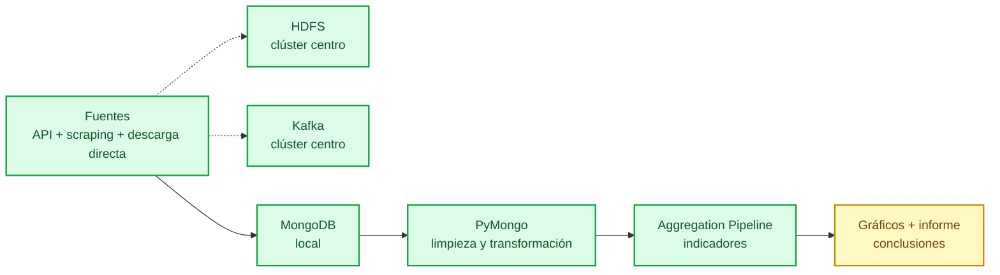

# bigdata-vivienda-euskadi — ¿Dónde pueden vivir los jóvenes en Euskadi?

Reto intermodal **SBD + BDA**: pipeline en Python que analiza la accesibilidad
de la vivienda para la población joven en Euskadi con datos reales, verificando
cada criterio contra la rúbrica del reto.

## 🎯 Objetivo

Responder con datos: ¿puede una persona joven independizarse en Euskadi con su
salario? ¿Qué municipios ofrecen mejores posibilidades de emancipación y por qué?
Todo el recorrido (extracción, almacenamiento, análisis, visualización) está en
Python y se verifica contra la rúbrica del reto.

## 🏗️ Arquitectura del pipeline


```mermaid
flowchart LR
    accTitle: Pipeline de datos vivienda Euskadi
    accDescr: Flujo de fuentes a resultados: extraccion, HDFS, Kafka, MongoDB, limpieza, agregacion, visualizacion.

    src["Fuentes<br/>API + scraping + descarga directa"]
    hdfs["HDFS<br/>clúster centro"]
    kafka["Kafka<br/>clúster centro"]
    mongo["MongoDB<br/>local"]
    clean["PyMongo<br/>limpieza y transformación"]
    agg["Aggregation Pipeline<br/>indicadores"]
    viz["Gráficos + informe<br/>conclusiones"]

    src --> mongo --> clean --> agg --> viz
    src -.-> hdfs
    src -.-> kafka

    classDef done fill:#dcfce7,stroke:#16a34a,stroke-width:2px,color:#14532d
    classDef partial fill:#fef9c3,stroke:#ca8a04,stroke-width:2px,color:#713f12
    classDef todo fill:#fee2e2,stroke:#dc2626,stroke-width:2px,color:#7f1d1d
    class src done
    class hdfs,kafka done
    class mongo,clean,agg done
    class viz partial
```

> 🟢 Extracción, Silver, MongoDB, HDFS centro y Kafka centro completados.
> 🟡 Pendiente solo el gate extremo a extremo y el informe/demo final.

### Modelo de datos (relaciones por `codigo_ine`)


```mermaid
erDiagram
    DIM_MUNICIPIOS ||--o{ ALQUILER_MUNICIPAL : "codigo_ine"
    DIM_MUNICIPIOS ||--o{ ANALISIS_VARIABLES_BASE : "codigo_ine"
    DIM_MUNICIPIOS ||--o{ TRANSPORTE_PARADAS : "codigo_ine"
    DIM_MUNICIPIOS ||--o{ CERT_ENERGETICO : "codigo_ine"
    DIM_MUNICIPIOS ||--o{ POBLACION_JOVEN : "codigo_ine"
    DIM_MUNICIPIOS ||--o{ MUNICIPIO_AREA_FUNCIONAL : "codigo_ine"
    DIM_MUNICIPIOS ||--|| EUSTAT_DEMOGRAFIA : "codigo_ine"
    DIM_MUNICIPIOS ||--o{ ANUNCIOS_UNIFICADOS : "codigo_ine (parcial)"
    DIM_MUNICIPIOS ||--o{ DISTANCIAS_CAPITALES : "codigo_ine"

    DIM_MUNICIPIOS {
        string codigo_ine PK
        string nombre_canonico
        string territorio
        string tipologia_mercado
        int n_anuncios
    }
    ALQUILER_MUNICIPAL {
        string codigo_ine FK
        float alquiler_medio_eur_m2
        string nivel_geografico
        string fuente
    }
    ANALISIS_VARIABLES_BASE {
        string codigo_ine FK
        float tasa_paro_lanbide_pct
        float ocupacion_juvenil_16_24_pct
        float densidad_poblacion
        float dist_centroide_comarca_km
    }
    ANUNCIOS_UNIFICADOS {
        string codigo_ine FK
        float precio_eur
        float superficie_m2
        string modalidad
        string portal
    }
```

## 📊 Estado del proyecto

| Fase | Entrega | Estado |
|---|---|---|
| 0 | Entorno + contrato + tests | ✅ Hecha |
| 1 | Extracción (scripts 01–06 + auxiliares) | ✅ Hecha |
| 1b | Salarios INE EPA (script 07) | ✅ Hecha |
| 1c | Pisos.com (script 08) | ✅ Hecha |
| 1d | Idealista/RealtyAPI (script 09) | ✅ Opcional, 84 anuncios |
| 2 | Descargas directas Open Data Euskadi (EMAL, Etxebide, GTFS) | ✅ Hecha |
| 3 | Transformaciones (entity resolution, dim_municipios, distancias, filtrado, enriquecimiento, geojson, metadata) | ✅ Hecha (parcial) |
| 3b | Cuarentena Silver + vistas de mercado + profiling + mapa esquema | ✅ Hecha |
| 4 | HDFS centro + Mongo local sin Docker Compose en repo | ✅ Hecha (HDFS centro + Mongo local) |
| 5 | Subida HDFS + recuperación | ✅ Hecha (352 ficheros raw en /user/iabd-user15/bigdata_reto/vivienda_euskadi/data/raw, sin legacy) |
| 6 | Modelado + operaciones PyMongo | ✅ Hecha (14 colecciones, PyMongo) |
| 7 | Aggregation Pipeline | ✅ Hecha (10 pipelines) |
| 8 | Kafka productor/consumidor | ✅ Hecha (broker del centro 10.22.87.215:9092, topic `anuncios_inmobiliarios` 1 partición, productor de manifiesto y consumidor que sube a HDFS) |
| 9 | Gráficos desde PyMongo | ✅ Hecha (CSV desde Mongo) |
| 10 | Informe, arquitectura y demo | 🟡 Parcial (arquitectura actualizada) |

> **HDFS: solo `raw` (excepción acordada con la profesora).** Se publican los 352 ficheros de `data/raw`; los `procesado` **no** se suben por indicación expresa de la profesora. El criterio BDA «organiza originales **y** procesados» se cubre con la organización de originales, la recuperación verificada (`scripts/hdfs_recuperacion_un_fichero.py`) y esta excepción declarada, no supuesta.

Tests del contrato: `177 passed, 1 skipped` (178 collected, ver `pytest tests/ -q`; WP-19 incluido + 15 pisos re-resolucion + 7 Tier confianza). P-08 actualizado a rubrica v2: 19 criterios y 21 requisitos vigentes en contrato-reto/spec.md.

## 📁 Estructura

```
bigdata-vivienda-euskadi/
├── tests/             Verificación del contrato
├── config/
│   └── fuentes.yaml   URLs, IDs, cobertura y notas de cada fuente
├── extract/           Extracción API, scraping y descargas directas
├── transform/         Limpieza y enriquecimiento (44 scripts; 34 en el DAG)
├── storage/           PyMongo + HDFS central + Kafka VM (listos)
├── analysis/          Aggregation Pipeline (hecho, 10 pipelines) + CSV desde Mongo
├── notebooks/         Informe de resultados (pendiente)
├── data/raw/          Datos generados (ignorados por git, 356 archivos)
├── data/procesado/    Datos normalizados (ignorados por git, 188 archivos, manifest 188)
├── data/resultados/   Indicadores y gráficos (ignorados por git)
├── docs/              Documentación (índice en docs/README.md)
└── plan/              Planificación y decisiones
```

## 📈 Datos actuales (silver)

| Métrica | Valor |
|---|---:|
| Municipios de referencia | 252 |
| Archivos raw (bronce) | 356 en disco local; 352 ficheros raw publicados en HDFS (manifest local en `docs/raw_manifest_sha256.txt`) |
| Archivos raw por tipo | CSV 129, JSON 61, HTML 101, ZIP 49, XLSX 6, GEOJSON 2, otros 7 |
| Archivos silver | 188 (manifest 188: excluidos `.gitkeep`/`ingestion_manifest.json`/manifest; antes 185 como historia) |
| Anuncios unificados | 594 (326 larga estancia + 268 temporal) en 64 municipios |
| Anuncios residenciales | 326 en 53 municipios |
| Anuncios de habitaciones | 201 en 9 municipios |
| Municipios sin anuncios residenciales | 188 |
| Municipios robustos (n≥30) | 4 (Bilbao 204, Donostia 126, Getxo 50, Vitoria-Gasteiz 39) |
| Tipologia (n≥30 / n≥1+mercado) | Nivel1 4 / Nivel2 54 / Nivel3 194; Tier B 10-29 = 3 (Sopela 19, Zarautz 15, Santurtzi 11, solo indicativo, temporal!=larga) |
| Tier A/B/C/D (de `mongo_tier_confianza.csv`) | A fuerte 4 (Bilbao 204, Donostia 126, Getxo 50, Vitoria 39) / B indicativo 3 / C sin precio municipal 57 / D sin dato 188 |
| Precio medio observable | Solo 62/252 con anuncio real (resto None, sin IDW/comarcal); esfuerzo 252 contextual sobre 159 oficiales |
| Alquiler oficial Eustat | 159/252 (93 imputados por comarca) |
| Tests | 177 passed, 1 skipped (destructivo separado) |
| VPO | `viviendas=0` en `mongo_vpo_por_municipio.csv` significa «sin dato»: `NumViviendas` vacío en 406/406 promociones; no es stock |

## 🔍 Conclusiones del análisis (O1–O4)

- **O1 — ¿Puede un joven independizarse?** Esfuerzo canónico 18–34 oficial mediano 26,61%; 25,2% de los 159 municipios oficiales supera el 30% (40/159). Emancipación municipal no defendible (proxy renta). Puntuación 7/10. Sensibilidad IDW-252: 25,37% (47/252, 18,7%); IDW-93 med 23,38%. Legacy 16–29: mediana oficial 42,9% (no comparable, solo demo).
- **O2 — ¿Qué municipios son viables?** Solo 4 robustos Tier A (n≥30): Bilbao 48020 n 204, Donostia 20069 n 126, Getxo 48044 n 50, Vitoria-Gasteiz 01059 n 39; resto Nivel2 (54) / Nivel3 (194). Tier B 10-29 = 3 (Sopela 19, Zarautz 15, Santurtzi 11, solo indicativo, temporal!=larga). Ranking fino solo para Tier A. 8/10.
- **O3 — ¿Trabajo + vivienda barata?** r(conteo parados jóvenes, alquiler)=+0,39 (conteos, no tasa; no hay trade-off simple); r(densidad, alquiler)=+0,456; r(distancia mín. a capital, alquiler)=-0,603. 8/10.
- **O4 — ¿Limitaciones?** Proxy renta (falacia ecológica), 93 sin alquiler directo, solo 4 robustos, emancipación solo CAE, mezcla de años, ECVI solo territorial. 9/10.
- **Media global (42 preguntas):** 8,2/10.
- Renta como proxy salarial: Pearson renta–alquiler r≈0,28 (159 municipios).

## 📊 Artefactos visuales (data/resultados/)

- `mapa_esquema_silver.html` — grafo de relaciones entre 40 CSVs silver en disco (PyVis, hubs: dim_municipios, anuncios_unificados; generado 2026-11-01, verificar tras regeneracion).
- `auditoria_lagunas_silver.csv` — profiling de 40 CSVs (filas, nulos, cobertura/252 muns).
- `dashboard.html` / `dashboard_completo.html` — dashboards estaticos manuales con conclusiones (los generadores `transform/generar_dashboard_*.py` solo producen PNG, no HTML).
- NOTA (RA4 / P-05): `dashboard.html`, `dashboard_completo.html` y `mapa_esquema_silver.html` son **manuales** con valores tecleados y **no** son evidencia automática RA4; `G_gaps_limitaciones.png` se genera desde conteos Mongo en `analysis/run_analisis_mongo.py` (imputados/sin anuncios/sin precio), no con literales. La evidencia válida son los 6 CSV canónicos auto generados con PyMongo en `data/resultados/` según AGREGACION-01 (`mongo_esfuerzo_por_municipio.csv` 253 líneas, `mongo_alquiler_por_municipio.csv` 253, `mongo_modalidades.csv` 3, `comparativa_3_municipios_mongo.csv` 5, `mongo_accesibilidad_extendida.csv` 253, `mongo_vpo_por_municipio.csv` 323, `mongo_tier_confianza.csv` 253; + `mongo_vpo_terminadas_por_municipio.csv` 252 adicional).
- 12 PNG únicos (13 emitidos; g1 duplicado de A1 eliminado sin renumerar) — gráficos por bloques.
- `README.md` — índice de artefactos.

#### Demo KPI (8,5 s)

<p align="center">
  
</p>
<p align="center"><em>Demo KPI (8,5 s) — esfuerzo joven y ranking municipal (Bilbao 204 · Donostia 126 · Getxo 50 · Vitoria 39)</em></p>

#### Demo mapa Euskadi (8,5 s)

<p align="center">
  
</p>
<p align="center"><em>Demo mapa Euskadi (8,5 s) — pipeline HDFS→Kafka→Mongo + choropleth de 252 municipios y top robustos (Bilbao 204 · Donostia 126 · Getxo 50 · Vitoria 39)</em></p>

## 🚀 Puesta en marcha

### 1. Entorno Python

```bash
uv venv --python 3.12 .venv
uv pip install --python .venv/Scripts/python.exe -r requirements.txt
```

Variables de infraestructura (clúster centro):

```bash
export HDFS_URL=http://10.22.87.215:50070
export HDFS_USER=iabd-user15
export KAFKA_BOOTSTRAP_SERVERS=10.22.87.215:9092
export KAFKA_TOPIC=anuncios_inmobiliarios
```

### 2. Descargar la cartografía municipal

```bash
curl -L -o data/raw/shp_euskadi.zip \
  "https://www.geo.euskadi.eus/cartografia/DatosDescarga/Limites/MUNICIPIOS_5000_ETRS89.zip"
cd data/raw && unzip -o shp_euskadi.zip -d shp_euskadi && cd ../..
```

### 3. Ejecutar la extracción completa

```bash
.venv/Scripts/python.exe extract/main_ingest.py
```

### 4. Verificar contra el contrato

```bash
.venv/Scripts/python.exe -m pytest tests -q
```

### 5. Regenerar artefactos visuales

```bash
.venv/Scripts/python.exe transform/generar_dashboard_visual.py
.venv/Scripts/python.exe transform/generar_dashboard_completo.py
.venv/Scripts/python.exe transform/generar_mapa_esquema.py
.venv/Scripts/python.exe transform/auditar_lagunas_silver.py
```

## 🗂️ Fuentes de datos

Todas verificadas en octubre de 2026. Ver `config/fuentes.yaml` para URLs e IDs
completos.

| Fuente | Tipo | Cobertura |
|---|---|---|
| Eustat bankupx API | API JSON | Población, renta, PIB, tenencia por municipio |
| Eustat ExtractorBlob | CSV/XLSX | Alquiler municipal (€/m², €/mes, m²) |
| INE wstempus API | API JSON | Población, hogares, precios de compraventa |
| INE EPA (salarios) | API JSON | Salarios por edad/decil (INE) |
| INE ECVI | XLSX | Transacciones de vivienda por territorio |
| euskadi.eus | CSV | Emancipación juvenil (16 indicadores) |
| Open Data Euskadi (geo.euskadi.eus) | SHP | Límites municipales + áreas funcionales |
| Open Data Euskadi (opendata.euskadi.eus) | ODS/CSV | EMAL, Etxebide VPO, GTFS, SEPE/Lanbide, certificados energéticos, centros educativos/sanitarios |
| b5m Gipuzkoa (GFA) | API/JSON | Catálogo municipal y distancias por carretera |
| OSRM | API | Tiempos de ruta a capitales |
| SERPAVI/MIVAU | CSV/JSON | Renta municipal basada en datos fiscales |
| LANBIDE / SEPE | Web/CSV | Paro registrado por municipio |
| Fotocasa | Scraping | ~470 anuncios reales de alquiler |
| Pisos.com | Scraping | ~218 anuncios de alquiler |
| RealtyAPI.io (Idealista, no oficial) | API | Opcional, 84 anuncios |
| INE Atlas de la renta | Descarga directa | Rellena municipios faltantes de renta |
| Udalmap (api.euskadi.eus) | API | Actividad, ocupación, paro Lanbide, VPO, renta... |
| HDFS clúster centro | Infraestructura | `HDFS_URL=http://10.22.87.215:50070`, `HDFS_USER=iabd-user15` (352 ficheros raw sin legacy; solo `raw`, ver la excepción declarada arriba) |
| Kafka clúster centro | Infraestructura | `KAFKA_BOOTSTRAP_SERVERS=10.22.87.215:9092`, `KAFKA_TOPIC=anuncios_inmobiliarios` (broker `hadoop-master1.tartangalh.eus`, 1 partición, RF 1) |

## ✅ Verificación

- Tests: `.venv/Scripts/python.exe -m pytest tests -q` (177 passed, 1 skipped destructivo separado)
- MongoDB (36 passed en la suite Mongo antes del cierre): `.venv/Scripts/python.exe storage/load_mongo.py` (14 colecciones, PyMongo, índices); `.venv/Scripts/python.exe scripts/run_mongo_pipeline.py` (carga + limpieza + índices + agregación); `.venv/Scripts/python.exe analysis/run_analisis_mongo.py` (10 pipelines a CSV); `.venv/Scripts/python.exe -m pytest tests/test_mongo.py -q` y `.venv/Scripts/python.exe -m pytest tests/test_mongo_geo.py tests/test_mongo_comparativa.py -q`
- CSVs desde Mongo en `data/resultados/`: `mongo_esfuerzo_por_municipio.csv` (252 filas), `mongo_alquiler_por_municipio.csv` (252), `mongo_modalidades.csv` (2), `comparativa_3_municipios_mongo.csv` (4 filas: Bilbao 204, Donostia 126, Getxo 50, Vitoria-Gasteiz 39). Ver `docs/modelo_mongodb.md` y `docs/arquitectura_datos.md`.
- Manifest de extracción: `data/procesado/_meta/ingestion_manifest.json` (integridad SHA-256)
- Contrato de datos raw: `docs/contrato_datos_raw.md` — `data/raw/` es inmutable **por diseño**:
  solo `extract/` escribe ahí; `transform/` solo puede hacerlo vía `assert_raw_writable(reason)`
  (lista blanca de 2 scripts). Bloqueado por `tests/test_raw_guardrails.py`, no por convención.

## ⚠️ Cosas que faltan

- **HDFS:** listo en clúster centro `http://10.22.87.215:50070` con user `iabd-user15` y ruta `/user/iabd-user15/bigdata_reto/vivienda_euskadi/data/raw`. `storage/hdfs_utils.py` ahora lee `HDFS_URL` y `HDFS_USER` de entorno y sube el bronce sin legacy con estado en `data/_hdfs_state/hdfs_upload_raw.json`.
- **Kafka:** listo en el broker del clúster centro `10.22.87.215:9092` (`hadoop-master1.tartangalh.eus`), topic `anuncios_inmobiliarios` con 1 partición (RF 1). Productor y consumidor Python en `storage/kafka_raw_producer.py` (publica el manifiesto `{rel,size,sha256}` de cada fichero de `data/raw`) y `storage/kafka_hdfs_uploader.py` (consume y sube a HDFS, descartando por SHA lo que ya coincide). Kafka no escribe en Mongo: Mongo se carga en batch con `storage/load_mongo.py`. Tests offline del pipeline en `tests/test_kafka_pipeline.py` (dobles de `KafkaProducer`/`KafkaConsumer`/`InsecureClient`, sin broker).
- **Informe y demo:** pendiente. Aggregation Pipeline, indicadores y CSV desde Mongo hechos (`analysis/run_analisis_mongo.py`); falta informe/demo final.
- **Cobertura de anuncios (83/252, solo 4 con n≥30):** limitación principal del ranking municipal fino. Los municipios sin datos se marcan “sin dato”.
- **Alquiler oficial (159/252 sin dato):** completado parcialmente con alquiler comarcal para los 93 faltantes.
- **Paro: `tasa_paro_aprox_pct` invalidado** → usar `tasa_paro_lanbide_pct` del Udalmap/Lanbide.
- **Distancias completas (252×252):** generadas con Haversine, pero solo Gipuzkoa tiene distancia por carretera.

## 📚 Concepciones clave

- **Renta como proxy de capacidad económica:** no existe salario municipal por edad disponible gratuitamente en Euskadi. Se usa la renta media municipal (Eustat 2024) como proxy. Pearson renta–alquiler r≈0,28 (159 municipios).
- **Alquiler como eje, compraventa como contraste:** el criterio evalúa el alquiler; la compraventa aparece como dato complementario.
- **Correlación renta–alquiler débil:** la renta local explica poco el precio del alquiler. Otras variables explican más: oferta, demanda, turismo, distancia a capitales, tamaño del municipio.
- **Cobertura de anuncios:** n≥30 como umbral de robustez, “sin dato” como valor legítimo para municipios sin anuncios.
- **Temporal vs larga estancia:** no mezclar. Los anuncios de alquiler temporal tienen un precio ~24% mayor.
- **Paro y actividad:** fuente oficial municipal (Udalmap + Lanbide). `tasa_paro_aprox_pct` invalidado → usar `tasa_paro_lanbide_pct`.

## 📖 Documentación

Ver `docs/README.md` para el índice completo de documentos vigentes y `argon/` para la copia de revisión externa.

## 🔁 Flujo extremo a extremo

El flujo actual tiene dos ramas sobre los mismos originales: fuente → silver → Mongo local (batch, `storage/load_mongo.py`) → agregación → visualización; y `data/raw` → Kafka (productor de manifiesto, consumidor que sube a HDFS) → HDFS centro. HDFS es la memoria de originales con recuperación SHA y Mongo es la base analítica. Kafka no escribe en Mongo: la Integración (2+ fuentes por un campo común) se acredita en Mongo con `codigo_ine` (252 municipios ↔ anuncios ↔ alquiler).

## ⚠️ Puntos débiles (limitaciones defendibles)

- Cobertura de anuncios: solo 83/252 municipios, 4 robustos (n≥30). Ranking municipal fino no defendible para la mayoría.
- Alquiler oficial: solo 159/252; 93 imputados por comarca (no municipal).
- Proxy renta (falacia ecológica): renta municipal aplicada homogéneamente, no captura precariedad juvenil.
- Emancipación solo a nivel CAE, no municipal.
- Mezcla de años: anuncios 2026 vs alquiler/renta 2024.
- VPO: 406 promociones en 77 municipios con `NumViviendas` vacío (stock no público); el flujo oficial municipal se integra aparte.
- ECVI solo territorial/área funcional, no municipal.
- Correlaciones laborales débiles/espurias: paro-alquiler r≈0,385 (conteos) / 0,146 (tasas); afiliación SS vs alquiler ≈-0,011.
- Infraestructura: MongoDB hecho (14 colecciones, 10 pipelines), HDFS centro y Kafka centro listos y documentados, falta solo el gate extremo a extremo y la demo final.
- Distancias por carretera solo Gipuzkoa; Álava/Bizkaia por Haversine.
